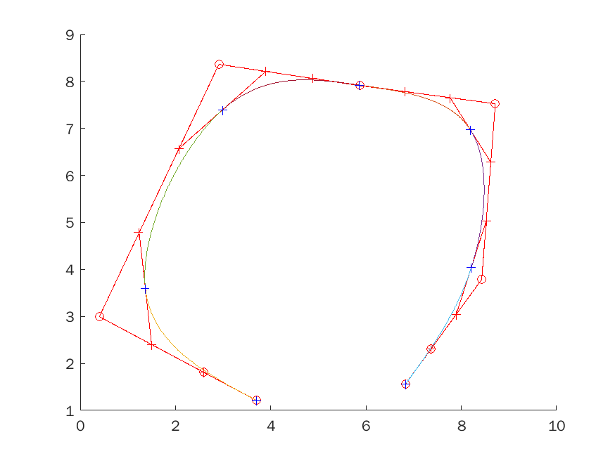

# bezier curve 3

## points and images
x1 = [3:6942; 1:3690; 2:9865; 5:8509; 8:1929; 8:2098; 6:8281]
y1 = [1:2144; 3:5925; 7:3933; 7:9217; 6:9665; 4:0396; 1:5600]

x2 = [3:9806; 2:2789; 3:6942; 6:8618; 7:1820]
y2 = [2:1087; 4:2429; 7:0884; 6:9461; 4:3852]

x3 = [4:2334; 1:0826; 1:3016; 4:9579; 8:2435; 4:8062]
y3 = [1:0315; 3:6941; 5:6250; 7:9624; 5:5640; 5:8486]

x4 = [4:6040; 2:2283; 3:3741; 2:1609; 7:2494; 6:8955; 9:1702]
y4 = [1:3364; 1:6616; 3:5722; 6:8242; 8:6535; 3:7957; 2:8608]

x5 = [2:7310; 1:3599; 1:1662; 1:9709; 4:7876; 7:0827; 6:2630;
4:2809; 3:9232; 4:9367; 8:3048; 9:0052; 7:6639]
y5 = [1:1106; 2:4716; 5:3639; 7:3677; 8:3129; 7:6134; 5:3072;
5:0614; 2:8875; 1:0539; 0:8648; 2:5095; 3:7760]

---

## get our own points

